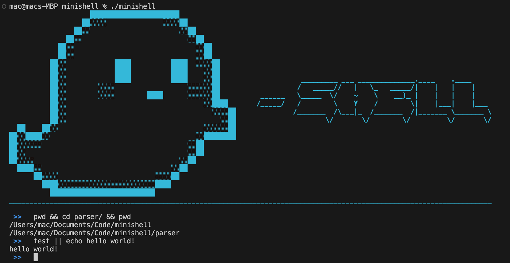
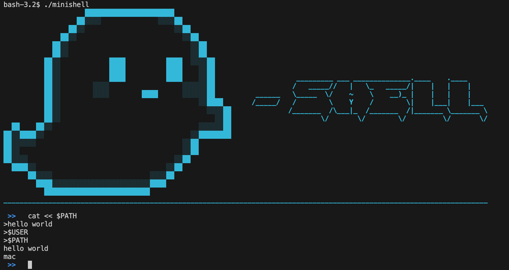

<!-- Improved compatibility of back to top link: See: https://github.com/othneildrew/Best-README-Template/pull/73 -->
<a name="readme-top"></a>

<!-- PROJECT LOGO -->
<br />
<div align="center">
  <a href="https://github.com/42sin/minishell">
    
  </a>

<h3 align="center">Minishell</h3>

  <p align="center">
    As beautiful as a shell
    <br />
    <a href="https://github.com/42sin/minishell/issues">Report Bug</a>
    ·
    <a href="https://github.com/42sin/minishell/issues">Request Feature</a>
  </p>
</div>


<!-- TABLE OF CONTENTS -->
<details>
  <summary>Table of Contents</summary>
  <ol>
    <li>
      <a href="#about-the-project">About The Project</a>
    </li>
    <li>
      <a href="#getting-started">Getting Started</a>
      <ul>
        <li><a href="#prerequisites">Prerequisites</a></li>
        <li><a href="#installation">Installation</a></li>
      </ul>
    </li>
    <li><a href="#usage">Usage</a></li>
    <li><a href="#features">Features</a></li>
    <li><a href="#license">License</a></li>
  </ol>
</details>


<!-- ABOUT THE PROJECT -->
## About The Project

#### [Go to Subject PDF]
[![Subject PDF][subjectImage]](en.minishell_subject.pdf)

This is the first group project of the 42 core curriculum. The objective of this project is to create a simple bash-like shell. There were specific Project specifications, like only being allowed to use a few low-level functions and POSIX system calls. If you want to know more about the requirements, take a look at the Subject PDF. This project was done in collaboration with <a href="https://github.com/FlorianBindereif">Florian Bindereif</a>
<p align="right">(<a href="#readme-top">back to top</a>)</p>

<!-- GETTING STARTED -->
## Getting Started

The Project was mainly tested on macOS, but it should work on all UNIX/LINUX based systems.

### Prerequisites

To run the Minishell, you need to install the readline library first, which can be done like this:
  ```sh
  brew install readline
  ```
Or
  ```sh
  apt-get install libreadline-dev
  ```

### Installation

1. Clone the repo
   ```sh
   git clone https://github.com/42sin/minishell.git && cd minishell
   ```
2. Change the readline path inside of the Makefile, you can see your path with `brew info readline`
   ```Makefile
   -I/usr/local/opt/readline/include
   -L/usr/local/opt/readline/lib
   ```
3. Compile the project
   ```sh
   make
   ```
4. Run the minishell
   ```sh
   ./minishell
   ```

<p align="right">(<a href="#readme-top">back to top</a>)</p>

<!-- USAGE EXAMPLES -->
## Usage

You can use the minishell as you would use any other Shell to execute commands. We handled a lot of unnecessary things that were not specifially required by the Subject, which you can read more about in <a href="#features">Features</a>

Here is an example of a basic command using some of the control operators.


This is a more advanced example where you can see the implementation of Here Documents, the variable used as a delimiter isn't expanded but the ones used inside of the Here Document are expanded.


<p align="right">(<a href="#readme-top">back to top</a>)</p>

<!-- Features -->
## Features

### Basics:
<ul>
  <li>History of previously entered commands</li>
  <li>Search and launch the right executable (based on the PATH variable, using a relative or an absolute path)</li>
  <li>Environment variables ($ followed by a sequence of characters) expand to their values</li>
  <li>Wildcards *</li>
  <li>Ctrl-C, Ctrl-D, and Ctrl-\ behave like in bash</li>
  <li><code>’</code> (single quotes - prevent from interpreting meta-characters in quoted sequence)</li>
  <li><code>"</code> (double quotes - prevent from interpreting meta-characters in quoted sequence except for $)</li>
  <li><code>$?</code> expands to the last exit status</li>
  <li><code>|</code> Output of a command is connected to the input of the next Command</li>
  <li><code>&amp;&amp;</code> and <code>||</code> with parenthesis for priorities</li>
</ul>

### Builtins:
<ul>
  <li><code>echo</code> with <code>-n</code></li>
  <li><code>cd</code> (relative or absolute path, <code>~</code> for HOME)</li>
  <li><code>pwd</code></li>
  <li><code>export</code> without arguments or with a new environment variable to be set</li>
  <li><code>unset</code></li>
  <li><code>env</code></li>
  <li><code>exit [exit_status]</code></li>
</ul>

### Redirections:
<ul>
  <li><code>[n] &lt; file</code> Redirecting Input</li>
  <li><code>[n] &lt;&lt; limiter</code> Here Documents with environment variable handling</li>
  <li><code>[n] &gt; file</code> Redirecting Output</li>
  <li><code>[n] &gt;&gt; file</code> Appending Redirected Output</li>
</ul>


<p align="right">(<a href="#readme-top">back to top</a>)</p>

<!-- LICENSE -->
## License

Distributed under the MIT License. See `LICENSE` for more information.

<p align="right">(<a href="#readme-top">back to top</a>)</p>

<!-- MARKDOWN LINKS & IMAGES -->
[issues-url]: https://github.com/42sin/minishell/issues
[license-url]: https://github.com/42sin/minishell/blob/master/LICENSE.txt
[subjectImage]: eval.png
[Go to Subject PDF]: en.minishell_subject.pdf
